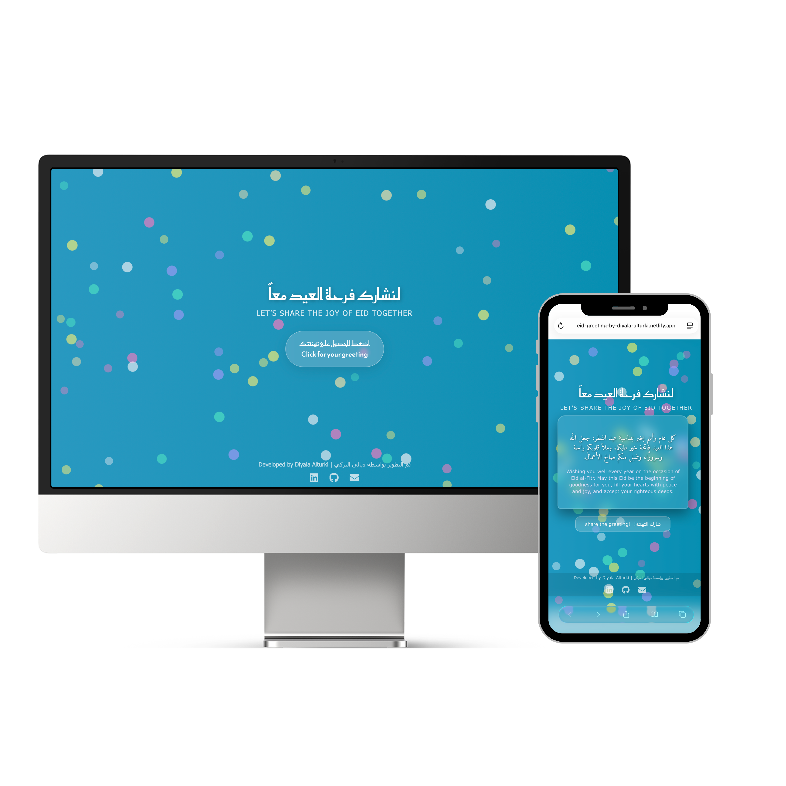

# Eid Greeting Generator 🎉 | مولد تهاني العيد

A simple and fun web app that spreads joy during Eid by generating random greetings in Arabic and English.  

تطبيق ويب بسيط وممتع ينشر فرحة العيد من خلال عرض تهاني عشوائية بالعربية والإنجليزية.

🌐 **Live Demo / تجربة مباشرة:** [https://eid-greeting-by-diyala-alturki.netlify.app](https://eid-greeting-by-diyala-alturki.netlify.app)

---

## Preview | معاينة

---

## Features | المميزات

- **Random Eid Greetings** – Generates a random Eid greeting in Arabic and English each time the button is clicked.  
  **تهاني عيد عشوائية** – يتم عرض تهنئة عيد عشوائية بالعربية والإنجليزية عند الضغط على الزر.

- **Button Click Sound** – Plays a sound effect when the user clicks the button to start the greeting.  
  **صوت عند الضغط** – يتم تشغيل صوت عند الضغط على الزر لبدء التهنئة.

- **Animated Envelope Reveal** – A stylish animated envelope rises and opens to reveal the greeting message.  
  **أنيميشن ظرف الرسالة** – يظهر ظرف متحرك يصعد ويفتح ليكشف رسالة التهنئة.

- **Confetti Celebration** – Confetti animation appears when the greeting is generated to create a festive feeling.  
  **احتفالية الكونفيتي** – يظهر تأثير الكونفيتي عند عرض التهنئة لإضفاء جو احتفالي.

- **Animated Colorful Background Circles** – Floating colorful circles animate in the background for a festive atmosphere.  
  **دوائر ملوّنة متحركة** – دوائر ملوّنة متحركة في الخلفية تضيف أجواء احتفالية.

- **Share Greeting as Image** – Users can share the greeting as an image using the device share feature or download it automatically.  
  **مشاركة التهنئة كصورة** – يمكن مشاركة التهنئة كصورة عبر ميزة المشاركة في الجهاز أو تحميلها تلقائياً.

- **Smooth Animations & Transitions** – Multiple CSS animations enhance the user experience.  
  **حركات وانتقالات سلسة** – مجموعة من الأنيميشن لتحسين تجربة المستخدم.

- **Responsive Design** – Fully responsive layout optimized for mobile and desktop.  
  **تصميم متجاوب** – تصميم متوافق مع الجوال وأجهزة الكمبيوتر.

- **Social Links Footer** – Footer includes links to LinkedIn, GitHub, and Email.  
  **روابط التواصل في الفوتر** – روابط للتواصل عبر لينكدإن وجيت هاب والبريد الإلكتروني.

---

## How it Works | كيف يعمل

1. **Click the main button** to start the greeting experience.  
   **اضغط الزر الرئيسي** لبدء تجربة التهنئة.

2. **A festive sound plays and confetti appears** to celebrate the moment.  
   **يتم تشغيل صوت احتفالي ويظهر تأثير الكونفيتي** لإضافة أجواء العيد.

3. **An animated envelope rises and opens** to reveal a random Eid greeting in Arabic and English.  
   **يظهر ظرف متحرك يصعد ويفتح** ليكشف تهنئة عيد عشوائية بالعربية والإنجليزية.

4. **Click the share button** to generate an image of the greeting and share it or download it.  
   **اضغط زر المشاركة** لإنشاء صورة للتهنئة ومشاركتها أو تحميلها.

---
